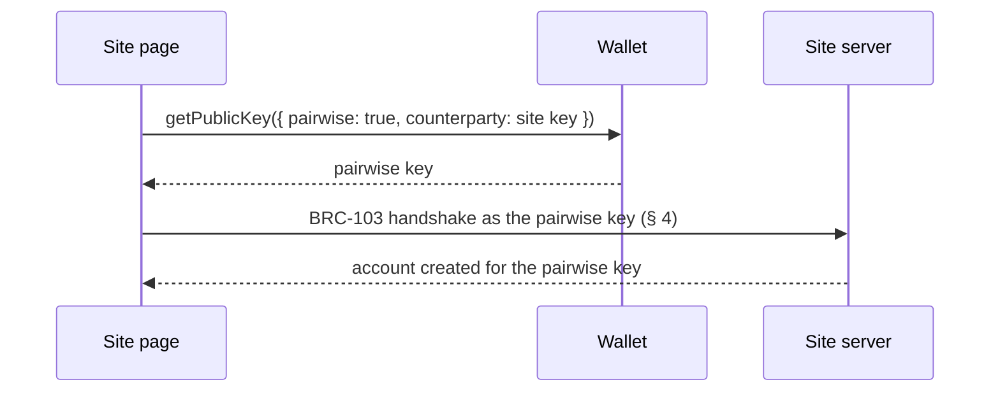
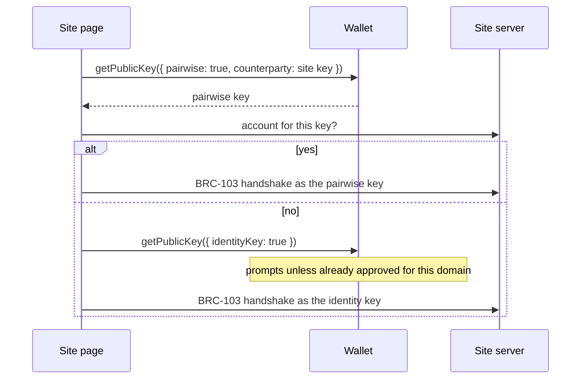
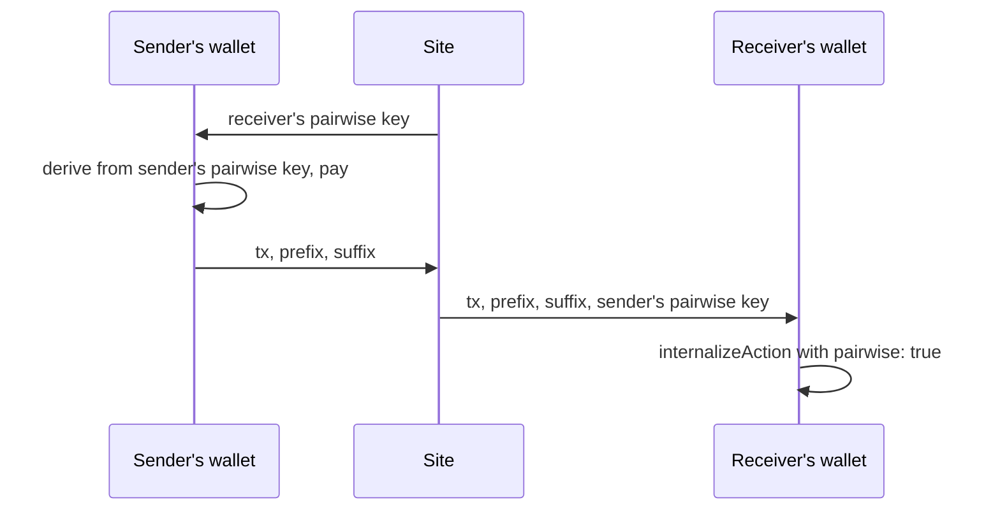

# BRC-182: Pairwise Authentication

Matthew Archbold (matthew.archbold@marstonenterprises.com), Marston Enterprises

## Abstract

A [BRC-100](../wallet/0100.md) (Unified, Vendor-Neutral, Unchanging, and Open BSV Blockchain Standard
Wallet-to-Application Interface) wallet authenticates to every site with the same **identity key**, its master public key.
Any two sites that hold it can tell they have the same user, and the user can't take it back or clear
it.

This document specifies **pairwise authentication**: the wallet authenticates to each site with a
key derived from the user's master key and **that site's public key**. The key is stable at one site,
so the user can create an account and log back in. It differs at every other site, so sites can't
use it to link the user. It uses existing [BRC-42](../key-derivation/0042.md) (BSV Key Derivation Scheme (BKDS))
derivation, the existing [BRC-103](./0103.md) (Peer-to-Peer Mutual Authentication and Certificate
Exchange Protocol) message format and the existing [BRC-105](../payments/0105.md) (HTTP Service
Monetization Framework) payment headers. What it adds is one wallet-interface flag, a reserved derivation, and the rules a wallet
follows to keep sites from choosing the user's key for them.

## Motivation

### The identity key is the same at every site

BRC-100 calls the master public key the **identity key**. BRC-103 authenticates a peer by the key in its `identityKey` field, and the reference SDK fills that field
with `getPublicKey({ identityKey: true })`. So a user who logs in to twenty sites gives each of them
the same permanent identifier.

The registry already says this should change, and already names the principle:

> *"Ordinary authentication should use an application-specific derived key. That identifier should
> be unique to the defined application context, separate from payment keys, replaceable if the
> relationship ends and unusable for discovering the user across unrelated services."*
> [BRC-151](../opinions/0151.md) (BRC-100 Risk Assessment and Best Integration Practices)

> *"An application domain is not automatically an extra cryptographic separator simply because the
> wallet knows which application made the request."* and *"The enduring principle is contextual
> identity."* [BRC-191](../opinions/0191.md) (Thoughts on Identity, Privacy and Recovery on the
> Metanet)

No BRC specifies how a wallet does it. This document does.

### Why the site's key, and not the site's address

A key derived from the site's **public key** is the ordinary BRC-42 shared-secret construction: the
user's private key and the site's public key give a key only those two parties share. It also makes
the site's identity, not its domain name, the thing the account belongs to, which matches how
BRC-103 already identifies the site.

## Terminology

The key words MUST, MUST NOT, SHOULD, SHOULD NOT and MAY are to be interpreted as described in
RFC 2119.

- **Identity key**: the wallet's master public key, as defined in BRC-100. The same at every site.
- **Pairwise**: one value per pair of parties, so that no third party can link the values used with
  different counterparties. The term follows OpenID Connect Core 1.0 § 8, which defines `public` and
  `pairwise` subject identifiers. In product copy the same idea is often called *site-scoped*.
- **Site key**: the public key a site authenticates with in BRC-103. It belongs to the site.
- **Pairwise key**: the user's key for one site, derived as in § 1. It belongs to the user.
- **Calling domain**: the domain the wallet attributes a request to. BRC-100 calls this the
  `originator`. Wallets reached by a web page take it from the browser (for example the `Origin`
  header), which the page cannot set.

## Specification

### 1. Deriving the pairwise key

The pairwise key is the BRC-42 child of the user's master key with:

| Input | Value |
|---|---|
| Counterparty | `self` |
| Invoice number | `2-admin pairwise-<site key> <version>` |

- The invoice follows [BRC-43](../key-derivation/0043.md) (Security Levels, Protocol IDs, Key IDs and
  Counterparties): security level `2`, protocol ID `admin pairwise`, and a key ID made of the site key
  (33-byte compressed, lowercase hex), one space, and a version number in decimal. Version `1` gives
  `2-admin pairwise-<site key> 1`.
- **The counterparty is `self`, not the site key.** BRC-42 is symmetric: a key derived from the user's
  private key and the site's public key can also be computed from the site's private key and the
  user's public key. With the site key as counterparty, a site could take any identity key it knows,
  compute what that user's pairwise key would be, and compare it with the key it was shown, unmasking
  the user without any help from another site. With `self`, the shared secret comes from the user's
  private key alone. The site key in the key ID still makes the key different at every site.
- The protocol ID starts with `admin`, which [BRC-44](../key-derivation/0044.md) (Admin-reserved and
  Prohibited Key Derivation Protocols) reserves for the wallet's own use. A wallet MUST refuse any
  application request that names a protocol ID beginning with `admin`, at every security level. Only
  the wallet derives the pairwise key, and only through the `pairwise` flag in § 2. Without this rule,
  an application could request the pairwise key for any other site and link the user.
- The version gives a user more than one account at a site. A wallet MAY offer a fresh, unconnected
  account at the same site by using version `2`, `3` and so on. This document uses `1` throughout.
- Wallets MUST NOT store the pairwise key. It is re-derived on every use.

### 2. The `pairwise` flag

This document adds one optional boolean argument, `pairwise`, to the BRC-100 methods that take a
`protocolID`, `keyID` and `counterparty` (`getPublicKey`, `encrypt`, `decrypt`, `createHmac`,
`verifyHmac`, `createSignature`, `verifySignature`) and to each payment output of
`internalizeAction`.

`pairwise: true` means: **perform this operation starting from the pairwise key for the calling
domain's site key, instead of from the master key.** Every other argument keeps its BRC-100 meaning.

#### 2.1 Recording the site key

- The first call with `pairwise: true` from a calling domain MUST be a `getPublicKey` that supplies
  `counterparty` as the site key. The wallet records the pair (calling domain, site key).
- Every later call with `pairwise: true` from that domain uses the recorded site key. The application
  MAY supply `counterparty`, but it does not change which pairwise key is used.
- If a `getPublicKey` call supplies a site key that differs from the one recorded for the domain, the
  wallet MUST NOT silently replace it. It SHOULD show the user that the site's key has changed, and
  MUST NOT proceed without the user's approval.
- If a different calling domain supplies a site key already recorded for another domain, the wallet
  SHOULD warn the user. Two domains sharing one site key receive the same pairwise key and can link the
  user.

This is trust on first use: the wallet trusts the first site key a domain presents and holds the
domain to it afterwards.

#### 2.2 Rules

- `pairwise: true` together with `identityKey: true` MUST be rejected.
- `pairwise: true` together with `privileged: true` MUST be rejected.
- A call with `pairwise: true` discloses no identity key, and wallets SHOULD NOT show an identity-key
  prompt for it. Wallets MAY apply their usual protocol permissions.
- A wallet without this extension rejects the first call, `getPublicKey({ pairwise: true, counterparty })`,
  because BRC-100 requires `protocolID` and `keyID` for a derived key. Applications SHOULD treat that
  rejection as "not supported" and offer the public login. A wallet MUST NOT answer a `pairwise` call
  with the identity key.

### 3. Account creation and login

#### 3.1 Creating an account

A site offers two buttons: one for a private account and one for an account with the public identity
key.

**Private account.** The page calls:

```json
getPublicKey({ "pairwise": true, "counterparty": "<site key>" })
```

The wallet records the domain's site key (§ 2.1), derives the pairwise key and returns it with no
identity-key prompt:

```json
{ "publicKey": "<pairwise key>" }
```

**Public account.** The page calls:

```json
getPublicKey({ "identityKey": true })
```

The wallet MUST ask the user before disclosing the identity key, unless the user has already approved
it for that domain. It returns:

```json
{ "publicKey": "<identity key>" }
```

The application then runs the BRC-103 handshake (§ 4) with the returned key and creates the account
under it.



#### 3.2 Logging in

A site offers one login button. The application tries the pairwise key first:

1. The page calls `getPublicKey({ "pairwise": true, "counterparty": "<site key>" })` and receives the
   same pairwise key as at account creation.
2. If the site has an account for that key, the application completes the BRC-103 handshake as that
   key. The user is logged in with no prompt.
3. If not, the application SHOULD continue straight to `getPublicKey({ "identityKey": true })`,
   without a screen of its own. The wallet's identity-key prompt is the user's check: if the user
   intended a private login, they deny it and are not logged in.



Wallets MUST show a prompt before disclosing the identity key, and auto-approval MUST NOT silence it
for a domain the user has not approved. That prompt is what stops a page from requesting the identity
key behind a button labelled as private.

### 4. Mutual authentication

Pairwise authentication uses BRC-103 messages unchanged, carried as in [BRC-104](./0104.md) (HTTP
Transport for BRC-103 Mutual Authentication). The user's `identityKey` field carries the pairwise
key.

```json
{
  "version": "0.1",
  "messageType": "initialRequest",
  "identityKey": "<pairwise key>",
  "initialNonce": "<user nonce>"
}
```

The wallet operations BRC-103 performs on the user's side carry `pairwise: true`:

- **Verifying the site.** The site signs its `initialResponse` for the pairwise key. The page calls
  `verifySignature({ ..., "counterparty": "<site key>", "pairwise": true })`. The wallet MUST also
  check that the `identityKey` in the site's response equals the site key recorded for the calling
  domain.
- **Signing each request.** The page calls
  `createSignature({ "protocolID": [2, "auth message signature"], ..., "counterparty": "<site key>", "pairwise": true })`.
  The site verifies it against the pairwise key exactly as it would against an identity key.

A site's server needs no change to accept pairwise logins: it already verifies whatever key arrives in
`identityKey`.

### 5. Payments

BRC-105 runs inside a BRC-103 session and treats the session's
client key as the payer. Its headers and the `x-bsv-payment` body are unchanged. Either party can be
the sender or the receiver.

**Payments follow the key the session authenticated with.** The mode is set once, at login, and the
client side keeps it for the session. Every wallet call made in a pairwise session carries
`pairwise: true`; SDKs SHOULD add it automatically from the session, so applications don't set it per
call. `createAction` takes no flag: the flag goes on the `getPublicKey` call that derives the key to
pay. A site records and pays an account's key and needs no record of whether that key is pairwise for
payments to work. A site MAY store it for its own purposes. Once a payment is internalized, the output
carries its own record (§ 5.2), so spending it later doesn't depend on any session.

#### 5.1 Sending

A sender in a pairwise session MUST derive the payment from its pairwise key, by calling
`getPublicKey` with `pairwise: true` for the payment output:

```json
getPublicKey({
  "protocolID": [2, "3241645161d8"],
  "keyID": "<derivationPrefix> <derivationSuffix>",
  "counterparty": "<receiver's key>",
  "pairwise": true
})
```

The receiver will look for the payment as coming from the sender's session key. A payment derived
from the master key while the session key is the pairwise key can't be found or spent by the receiver.
For the same reason, an application MUST report the pairwise key, not the identity key, as the
sender's key.

#### 5.2 Receiving

A receiver in a pairwise session marks the output when it internalizes the payment:

```json
internalizeAction({
  "tx": "<Atomic BEEF>",
  "outputs": [{
    "outputIndex": 0,
    "protocol": "wallet payment",
    "paymentRemittance": {
      "derivationPrefix": "<prefix>",
      "derivationSuffix": "<suffix>",
      "senderIdentityKey": "<sender's key>"
    },
    "pairwise": true
  }],
  "description": "<description>"
})
```

The wallet MUST check that the output pays the key derived from its pairwise key, and MUST remember,
with the output, the site key it was received under.

*Informative.* In practice this is one optional field per output. Outputs without it are ordinary
outputs, so existing wallet data is unaffected.

#### 5.3 Spending

When a wallet signs an input that spends an output received under a pairwise key, it MUST derive the
signing key in two steps:

```
pairwise key  = BRC-42 child of the master key,  counterparty = self,   invoice 2-admin pairwise-<site key> 1
signing key   = BRC-42 child of the pairwise key, counterparty = sender,  invoice from the remittance
```

Each step is ordinary BRC-42. No secret is stored.

#### 5.4 Payments between two users of one site

Two users of the same site can pay each other without either identity key and without a separate
message relay. The site passes each user the other's pairwise key and carries the transaction,
prefix and suffix inside the two sessions. The sender follows § 5.1 with the receiver's pairwise key
as `counterparty`. The receiver follows § 5.2 with the sender's pairwise key as `senderIdentityKey`.



#### 5.5 Meeting BRC-151

- **Separate from payment keys.** Payments go to child keys derived from the pairwise key. The
  pairwise key itself never holds funds. It appears only as the sender's key in a remittance.
- **Replaceable.** The version in § 1's key ID gives a new, unconnected account.

### 6. Certificates

- **Sites MAY present certificates** in their BRC-103 `initialResponse`, as BRC-103 already allows.
  The field-revelation keys are encrypted to the pairwise key, so the page decrypts them with
  `decrypt({ "protocolID": [2, "certificate field encryption"], ..., "pairwise": true })`. Wallets MAY
  verify the certifier, check that the certificate's subject is the recorded site key and check that
  its revocation outpoint is unspent, and MAY show the user the result. Display and certifier trust
  are left to wallets.
- **Users can't present [BRC-52](./0052.md) (Identity Certificates) certificates on a pairwise
  session** without disclosing the identity key, because a BRC-52 certificate names the identity key
  as its subject. Unlinkable credentials, such as BBS signatures as specified in
  [the IETF BBS signature specification](https://datatracker.ietf.org/doc/draft-irtf-cfrg-bbs-signatures/) and W3C `bbs-2023`, are a candidate way to prove an attribute on a
  pairwise session without that key. The proof would be bound to the session, and the pairwise key
  would remain the user's stable identifier at that site. A full profile is out of scope and needs to
  be specified separately.

### 7. Relationship to other BRCs

- **BRC-151** recommends an application-specific authentication key. This document specifies one.
- **Prior art outside the registry.**
  [SLIP-0013](https://github.com/satoshilabs/slips/blob/master/slip-0013.md) (Authentication using
  deterministic hierarchy, Pavol Rusnak, SatoshiLabs, 2015) and
  [LUD-05](https://github.com/lnurl/luds/blob/luds/05.md) (BIP32-based seed generation for auth
  protocol, LNURL-auth) derive a
  per-site login key from a secret only the user holds plus the site's identifier, with an index or
  version for more keys per site. This document follows the same principle using BRC-42 and BRC-43,
  with the site's public key as the identifier.
- **[BRC-228](../payments/0228.md) (Unlinkable Payments under the Identity Paradigm)** uses a fresh,
  random key for every payment, and forbids deriving it from any reusable wallet secret. Pairwise keys
  are deterministic and stable per site, on purpose, so that accounts survive. The two address
  different links: BRC-228 hides a payer across payments, and this document hides a user across sites.
  BRC-191 notes that a payment made inside a session that already identifies the payer is not made
  anonymous by changing the payment key. Inside a pairwise session, what the site learns is the
  pairwise key.
- **[BRC-189](../wallet/0189.md) (Identity, Certificates, Discovery, and Personal Trust in
  Applications)** allows a person to *"choose different keys or wallet profiles for different
  contexts"*. This document is one such mechanism.
- **[BRC-137](../opinions/0137.md) (Device-Aware Wallet Onboarding and Fallback Login for BRC-100
  Applications)** describes nonce-signature login against the identity key. A site MAY offer both.

## 8. Security considerations

- **A site that changes its key loses its pairwise accounts.** The pairwise key depends on the site
  key, so a new site key gives every user a new pairwise key. Sites SHOULD treat their key as long-lived.
  Section 2.1 makes the change visible to the user rather than silent.
- **Sites that share a key can link users.** Two domains presenting one site key receive the same
  pairwise key. Section 2.1 tells wallets to warn when they see it.
- **The calling domain must come from the browser, not the page.** A wallet that accepts a domain
  supplied by the page lets one site claim to be another and read its pairwise key.
- **The pairwise key must not be computable by the site.** Section 1 derives it with counterparty
  `self` for this reason. A derivation that uses the site key as counterparty lets the site test any
  known identity key against a pairwise key and unmask the user.
- **The admin reservation is load-bearing.** A wallet that lets applications derive `admin` protocols
  gives any page every pairwise key. Section 1 makes refusal a MUST.

## 9. Privacy considerations

*Unlinkable* here means: two sites can't use the pairwise key to tell they share a user, and one site
can't use it to connect a user's pairwise account with a public account the same user holds there. It does not
hide the user from the site they are logged in to, from a certifier that issued them a credential, or
from analysis of the transaction graph, where inputs and change still belong to the same wallet.

## 10. Test vectors

Generated with `@bsv/sdk` 2.8.11 using fixed test keys. These private keys are public: never use
them for funds. All hex is lowercase; public keys are compressed.

**Pairwise key (§ 1)**

| | Value |
|---|---|
| User master private key | `0000000000000000000000000000000000000000000000000000000000000011` |
| User identity key | `03defdea4cdb677750a420fee807eacf21eb9898ae79b9768766e4faa04a2d4a34` |
| Site private key | `0000000000000000000000000000000000000000000000000000000000000022` |
| Site key | `031be68a5a028f2601d0e80d468c344ba331d611b96c358b6032e8b4da0547fc11` |
| Counterparty | `self` |
| Invoice | `2-admin pairwise-031be68a5a028f2601d0e80d468c344ba331d611b96c358b6032e8b4da0547fc11 1` |
| Pairwise private key | `12edeafb17aab433a6e958c014ba08974eb9ddba0540b9f8c8d44cb36888efff` |
| Pairwise key | `037be3648196bec37bb1eaf3af0d8b654d418f0230e6012ca25a315787afc33d46` |
| Pairwise key at a second site (site key `0270e6b44a2ac6083ab673bacb5cb7ca554b795b416e702c1c980bb7b87c78b8e9`) | `037bd821cb8312292ecfa1bc08670d4202f1893dd69465146e6e50d54dbd232358` |

**Payments (§ 5)**, protocol `[2, "3241645161d8"]`, prefix `cHJlZml4`, suffix `c3VmZml4`

| | Value |
|---|---|
| User pays site: output key | `036a823a3bdd9d9ef02bdbcd3becdec4862f58d3caded84171105a7043d451cdab` |
| Site pays user: output key | `02b03eb26a51d47abdbf683ec7678b64b9c47fb4de554255d20ea4df992488f7db` |
| Site pays user: user's two-step spending private key | `c1198013b3d38739d26908f2fe2a3805a371cd658c5ef82724fa9573af8ff2b5` |

**Payment between two users of the site (§ 5.4)**

| | Value |
|---|---|
| Receiver master private key | `0000000000000000000000000000000000000000000000000000000000000033` |
| Receiver pairwise key | `033f4d8d7ad66fc08440309a720aee9bd17b6709faeac3dfe033d1d077e3087053` |
| Output key (sender = the user above, from its pairwise key) | `032c0befee26bf0b89610cd212d818f601688755b5f6ed7b1d439f7d133117b793` |
| Receiver's two-step spending private key | `6b6b85a998c2a0df423acdbb4d27479e88c10daf375008964f613dbf7fc8fee1` |

**Checks an implementation should reproduce.**
- The site cannot compute the pairwise key from the user's identity key: deriving with protocol
  `admin pairwise`, the same key ID and the identity key as counterparty gives a different key.
- A login signature made from the pairwise key verifies at the site, and the user verifies the site's
  signature from the pairwise key.
- An HMAC made from the pairwise key verifies at the site, and the user decrypts from the pairwise key
  what the site encrypted to it.
- Each of these fails when the master key is used instead. A payment derived from the master key is
  not the key the receiver looks for, and a one-step spending derivation does not match the output.

## 11. Open questions

1. **Discovering the site key.** This document has the page supply it on first use. A site could also
   publish it at a well-known address so a wallet can confirm it.
2. **Domain granularity.** Whether `shop.example.com` and `example.com` count as one calling domain.
3. **Moving a site key.** A signed statement from the old site key over the new one would let wallets
   follow a planned change without a prompt.

## 12. Implementations

None yet.

## 13. Acknowledgements

Thanks to Bridget Doran for pointing out that payments received under a pairwise key could not be
spent without further wallet support, and that deriving the pairwise key with the site key as
counterparty would let a site unmask users from known identity keys.

## References

- [BRC-42](../key-derivation/0042.md): BSV Key Derivation Scheme (BKDS)
- [BRC-43](../key-derivation/0043.md): Security Levels, Protocol IDs, Key IDs and Counterparties
- [BRC-44](../key-derivation/0044.md): Admin-reserved and Prohibited Key Derivation Protocols
- [BRC-52](./0052.md): Identity Certificates
- [BRC-100](../wallet/0100.md): Unified, Vendor-Neutral, Unchanging, and Open BSV Blockchain Standard Wallet-to-Application Interface
- [BRC-103](./0103.md): Peer-to-Peer Mutual Authentication and Certificate Exchange Protocol
- [BRC-104](./0104.md): HTTP Transport for BRC-103 Mutual Authentication
- [BRC-105](../payments/0105.md): HTTP Service Monetization Framework
- [BRC-137](../opinions/0137.md): Device-Aware Wallet Onboarding and Fallback Login for BRC-100 Applications
- [BRC-151](../opinions/0151.md): BRC-100 Risk Assessment and Best Integration Practices
- [BRC-189](../wallet/0189.md): Identity, Certificates, Discovery, and Personal Trust in Applications
- [BRC-191](../opinions/0191.md): Thoughts on Identity, Privacy and Recovery on the Metanet
- [BRC-228](../payments/0228.md): Unlinkable Payments under the Identity Paradigm
- OpenID Connect Core 1.0, § 8 Subject Identifier Types
- SLIP-0013: Authentication using deterministic hierarchy, https://github.com/satoshilabs/slips/blob/master/slip-0013.md
- LUD-05: BIP32-based seed generation for auth protocol, https://github.com/lnurl/luds/blob/luds/05.md
- RFC 2119, Key words for use in RFCs to Indicate Requirement Levels
